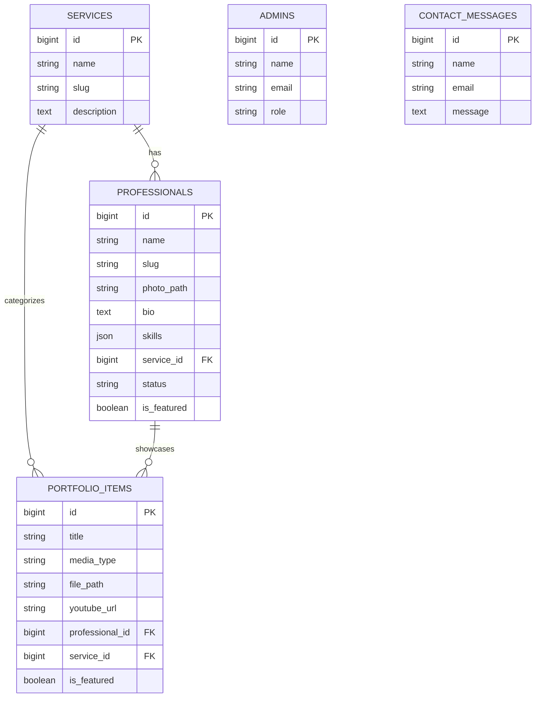

# GM Bridge — Technical Architecture

Reference doc for build. Companion to the system architecture diagram discussed in chat.

Stack: **Laravel 13 (API only) + Next.js 16 (App Router) + React 19 + MySQL**, connected over Sanctum, one Next.js app for both public and admin routes.

---

## 1. Database schema

```
services
├── id
├── name              e.g. "Video Editing"
├── slug              unique, used in URLs
├── description
├── icon               (svg name or key)
└── timestamps

professionals
├── id
├── name
├── slug               unique
├── photo_path
├── role_title          e.g. "Senior Video Editor"
├── bio                 text
├── skills               json array of strings
├── service_id          FK -> services.id
├── status               enum: active | inactive
├── is_featured           boolean, default false
└── timestamps

portfolio_items
├── id
├── title
├── description
├── media_type            enum: image | youtube | pdf
├── file_path              nullable, for image/pdf
├── youtube_url            nullable, for youtube
├── professional_id       FK -> professionals.id
├── service_id             FK -> services.id  (denormalized copy, see note)
├── is_featured             boolean, default false
└── timestamps

admins
├── id
├── name
├── email                  unique
├── password
├── role                    enum: superadmin | admin
└── timestamps

contact_messages
├── id
├── name
├── email
├── phone
├── message
└── timestamps
```

**Relationships**
- `services` 1—many `professionals`
- `services` 1—many `portfolio_items`
- `professionals` 1—many `portfolio_items`

**Why `service_id` is duplicated on `portfolio_items`:** it *could* be derived by joining through `professional_id → professionals.service_id`, but the Portfolio page filters and paginates on service constantly — storing it directly avoids a join on every request. Keep it in sync in the `PortfolioItem` model's save logic (auto-copy from the linked professional) rather than trusting the admin form to set it correctly.



**Media handling note:** since resizing happens on the Next.js side (`next/image`), Laravel just stores the original file and serves it from `storage/app/public` via the `storage:link` symlink. No image variants to generate or manage server-side.

**Upload limits (enforced in the Form Request classes, e.g. `StorePortfolioItemRequest`):**
```php
'image'    => ['nullable', 'file', 'mimes:jpg,jpeg,png,webp', 'max:5120'],   // 5MB, in KB
'pdf'      => ['nullable', 'file', 'mimes:pdf', 'max:20480'],                // 20MB, in KB
```
Two things worth double-checking before launch: PHP's own `upload_max_filesize` and `post_max_size` in `php.ini` default to 2MB on many hosts — they must be raised above 20MB or Laravel's validation never even gets a chance to run and the request just fails silently. And since media is on local disk (not S3), keep an eye on server disk space as the Portfolio grows — a few dozen 20MB PDFs adds up faster than images do.

---

## 2. Laravel structure (API only)

```
app/
├── Models/
│   ├── Service.php
│   ├── Professional.php
│   ├── PortfolioItem.php
│   ├── Admin.php
│   └── ContactMessage.php
│
├── Http/
│   ├── Controllers/
│   │   └── Api/
│   │       ├── ServiceController.php          (index, show)
│   │       ├── ProfessionalController.php     (index w/ filter, show)
│   │       ├── PortfolioItemController.php    (index w/ filter+search+paginate, show)
│   │       ├── ContactMessageController.php   (store)
│   │       ├── Admin/
│   │       │   ├── AuthController.php          (login, logout, me)
│   │       │   ├── ProfessionalController.php  (full CRUD)
│   │       │   ├── PortfolioItemController.php (full CRUD)
│   │       │   └── AdminUserController.php     (superadmin only: CRUD on admins table)
│   │
│   ├── Requests/
│   │   ├── StoreProfessionalRequest.php
│   │   ├── UpdateProfessionalRequest.php
│   │   ├── StorePortfolioItemRequest.php
│   │   ├── UpdatePortfolioItemRequest.php
│   │   └── StoreContactMessageRequest.php
│   │
│   ├── Resources/
│   │   ├── ServiceResource.php
│   │   ├── ProfessionalResource.php
│   │   ├── ProfessionalListResource.php    (lighter payload for grid views)
│   │   ├── PortfolioItemResource.php
│   │   └── AdminResource.php
│   │
│   └── Middleware/
│       ├── EnsureAdmin.php           (checks admin role, any admin)
│       └── EnsureSuperadmin.php      (checks role === superadmin)
│
└── Services/                          (thin service classes, optional but keeps controllers clean)
    ├── PortfolioFilterService.php     (builds the filter/search/paginate query)
    └── RevalidationService.php        (fires the Next.js revalidation webhook on save)

routes/
├── api.php            (public endpoints)
└── admin.php           (admin endpoints, prefixed /api/admin, sanctum + role middleware)
```

**Public API endpoints (no auth):**
```
GET  /api/services
GET  /api/services/{slug}
GET  /api/professionals?service=video-editing
GET  /api/professionals/{slug}
GET  /api/portfolio?service=video-editing&search=&page=       (10 per page, via Laravel's paginate(10))
GET  /api/portfolio/{id}
POST /api/contact
```

**Admin API endpoints (Sanctum + EnsureAdmin):**
```
POST   /api/admin/login
POST   /api/admin/logout
GET    /api/admin/me

GET    /api/admin/professionals
POST   /api/admin/professionals
PUT    /api/admin/professionals/{id}
DELETE /api/admin/professionals/{id}

GET    /api/admin/portfolio
POST   /api/admin/portfolio
PUT    /api/admin/portfolio/{id}
DELETE /api/admin/portfolio/{id}

# superadmin only (EnsureSuperadmin)
GET    /api/admin/admins
POST   /api/admin/admins
PUT    /api/admin/admins/{id}
DELETE /api/admin/admins/{id}
```

**Revalidation flow:** in `ProfessionalController@store/update/destroy` and `PortfolioItemController@store/update/destroy` (the admin versions), after a successful save, call `RevalidationService::revalidate($paths)`. That service does a simple `Http::post()` to a Next.js API route (`/api/revalidate`) with a shared secret token and the affected path(s) — e.g. `/talent`, `/talent/{slug}`, `/portfolio`. Keep this as a single reusable service so you're not duplicating the HTTP call in five places.

**Auth note (Sanctum, SPA mode):** since the admin panel lives inside the same Next.js app on the same top-level domain (just different routes), use Sanctum's SPA authentication (cookie-based, `EnsureFrontendRequestsAreStateful`) rather than issuing API tokens manually — it's simpler and gets CSRF protection for free. This needs `SANCTUM_STATEFUL_DOMAINS` set to your Next.js domain in `.env`.

---

## 3. Next.js structure (App Router)

```
app/                                    Routes ONLY — no shared code lives here
├── (public)/
│   ├── page.tsx                       Home
│   ├── services/
│   │   ├── page.tsx                    Services overview
│   │   └── [slug]/page.tsx             Service detail
│   ├── talent/
│   │   ├── page.tsx                    Talent grid (ISR)
│   │   └── [slug]/page.tsx             Professional profile (ISR)
│   ├── portfolio/
│   │   ├── page.tsx                    Portfolio grid, search+filter+pagination (ISR)
│   │   └── [id]/page.tsx               Portfolio item detail (ISR)
│   ├── about/page.tsx
│   └── contact/page.tsx
│
├── admin/
│   ├── layout.tsx                       Wraps all admin routes, checks session
│   ├── login/page.tsx
│   ├── dashboard/page.tsx
│   ├── professionals/
│   │   ├── page.tsx                     List + delete
│   │   ├── new/page.tsx
│   │   └── [id]/edit/page.tsx
│   ├── portfolio/
│   │   ├── page.tsx
│   │   ├── new/page.tsx
│   │   └── [id]/edit/page.tsx
│   └── admins/                           superadmin only
│       ├── page.tsx
│       └── new/page.tsx
│
└── api/
    └── revalidate/route.ts               Receives Laravel's webhook, calls revalidatePath()

middleware.ts                             Gates /admin/* by checking the
                                           admin_token cookie (Next.js's own
                                           domain — see auth note below)

lib/                                      Shared code lives at project root, imported as @/lib/...
├── api.ts                                PUBLIC endpoints only — fetch wrapper, error handling
├── admin-api.ts                          Server-only — adminFetch() helper, reads admin_token
│                                          cookie, attaches Bearer header, calls Laravel
└── types.ts                              shared TS types matching Laravel API Resources

components/                               Also at project root, imported as @/components/...
├── public/                               ServiceCard, ProfessionalCard, PortfolioGrid, ...
├── admin/                                 DataTable, FormField, MediaUploader, ...
└── ui/                                    shared primitives (Button, Input, Badge...)
```

**Admin auth note:** the backend (Laravel on a Herd `.test` domain) and
frontend (Next.js on its own domain) are genuinely different sites — not
just different ports. This rules out cookie-based Sanctum SPA auth for the
admin panel entirely: browsers strictly forbid JavaScript on one origin
from reading a cookie belonging to another origin, which makes the CSRF
double-submit pattern structurally impossible here, not just awkward to
configure. Because of this, the admin panel uses **token-based auth**:
Laravel issues a Sanctum personal access token on login; Next.js stores it
in an `httpOnly` cookie scoped to its own domain (readable by Next.js's
server, never by browser JS); every admin-authenticated call goes through
Next.js's own Route Handlers/Server Actions (via `lib/admin-api.ts`),
which attach the token as `Authorization: Bearer` when calling Laravel
server-to-server — the browser never talks to Laravel directly for
anything admin-related. This lets `middleware.ts` and Server Components
work normally for the admin panel, since the cookie middleware reads
belongs to Next.js's own domain.

Note: this project's tsconfig.json path alias is `"@/*": ["./*"]` — rooted at
the project root, not inside app/. Keeping lib/ and components/ as siblings
of app/ (rather than nested inside it) means imports read as `@/lib/api` and
`@/components/ui/Button`, matching that alias and standard Next.js
convention. app/ is reserved for routing only.

**Middleware note (`middleware.ts`):** this is the Next.js equivalent of your Laravel `auth:admin` middleware, but it runs at the edge before any page renders. It checks for a valid session cookie (set by Laravel via Sanctum on login) and redirects to `/admin/login` if missing — same mental model as what you already do in Laravel, just a different file and runtime.

**ISR implementation, concretely:**
```ts
// app/(public)/talent/page.tsx
export const revalidate = 3600;   // fallback: refresh at least hourly even if no webhook fires

async function getTalent() {
  const res = await fetch(`${process.env.API_URL}/professionals`, {
    next: { tags: ['talent'] }
  });
  return res.json();
}
```
```ts
// app/api/revalidate/route.ts
export async function POST(req: Request) {
  const { secret, tag } = await req.json();
  if (secret !== process.env.REVALIDATE_SECRET) {
    return Response.json({ message: 'Invalid secret' }, { status: 401 });
  }
  revalidateTag(tag);
  return Response.json({ revalidated: true });
}
```
Tag-based revalidation (`revalidateTag`) is cleaner than path-based here, since one Professional update should refresh both the Talent grid *and* that professional's own profile page — tag them both `talent` and `talent-{slug}` and revalidate precisely what changed.

**Image handling with `next/image`:**
```tsx
<Image
  src={professional.photo_url}   // full Laravel storage URL
  alt={professional.name}
  width={320}
  height={320}
  className="rounded-xl object-cover"
/>
```
Add Laravel's domain to `next.config.js` → `images.remotePatterns` so Next.js is allowed to optimize images served from it. Next.js then generates and caches the right size per breakpoint automatically — nothing to build in Laravel.

---

## Decisions locked in this round
- **Upload limits:** images up to 5MB, PDFs up to 20MB (validated in Form Requests; remember to raise `php.ini` limits to match)
- **Portfolio pagination:** 10 items per page
- **Featured content:** `is_featured` boolean added to both `professionals` and `portfolio_items`. Home's "featured talent / featured portfolio" strips just query `where('is_featured', true)->limit(n)` — no separate table or extra request type needed. Admin CRUD forms for both need a simple toggle to set it.

## Open items for next discussion
- Exact character limits on bios/descriptions (form validation + DB column sizing)
- Whether `is_featured` should have a max cap enforced (e.g. only 4 featured professionals at once) or left to admin discretion
